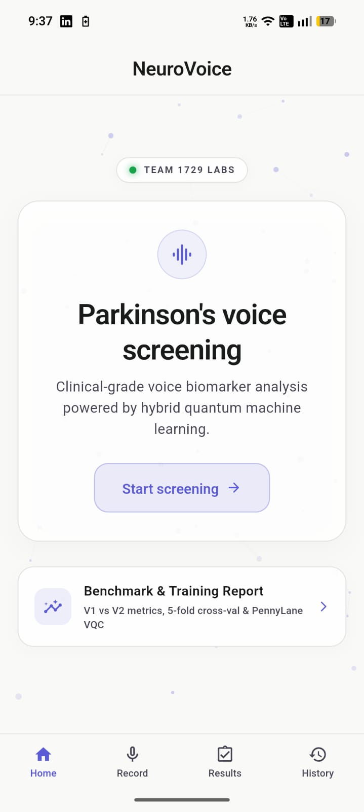

# 🧠 NeuroVoice 1729

[](https://flutter.dev)
[](https://fastapi.tiangolo.com)
[](https://pytorch.org)
[](https://pennylane.ai)
[](https://www.python.org)
[](https://github.com/rakesh20079/NueroVoice1729/raw/main/application/neurovoice.apk)

> ** Neurological biomarker screening system powered by hybrid quantum machine learning.**  
> Analyzes sustained vowel phonations (`/a/`) to detect early vocal stability perturbations, micro-tremor incidence, and clinical dysphonia markers using deep neural networks and 8-qubit Variational Quantum Circuits (PennyLane VQC).

---

## 📱 Mobile Application & Clinical UI

Experience the intuitive clinical screening interface built for physicians and patients:

<div align="center">
  <table>
    <tr>
      <td align="center" width="20%">
        <b>Home Dashboard</b><br/><br/>
        <br/><br/>
        <sub>One-tap screening initiation & research benchmark access</sub>
      </td>
      <td align="center" width="20%">
        <b>Low Likelihood</b><br/><br/>
        <br/><br/>
        <sub>94.2% confidence screening via PennyLane Quantum VQC</sub>
      </td>
      <td align="center" width="20%">
        <b>Clinical Analysis</b><br/><br/>
        <br/><br/>
        <sub>Vocal stability, tremor incidence & acoustic metric telemetry</sub>
      </td>
      <td align="center" width="20%">
        <b>High Risk Detection</b><br/><br/>
        <br/><br/>
        <sub>96.2% confidence alert with key influencing features</sub>
      </td>
      <td align="center" width="20%">
        <b>Diagnostic Rationale</b><br/><br/>
        <br/><br/>
        <sub>In-depth spectral irregularity analysis & model rationale</sub>
      </td>
    </tr>
  </table>
</div>

---

## ⚡ Direct Application Download

Get the compiled mobile application directly:

- 📦 **Android APK:** [`neurovoice.apk`](https://github.com/rakesh20079/NueroVoice1729/raw/main/application/neurovoice.apk) (Located in [`application/neurovoice.apk`](application/neurovoice.apk))

---

## ✨ Key Features

- **Standardized Audio Acquisition**: 16,000 Hz single-channel capture with strict sustained vowel duration validation (5–10s) and automatic silence trimming.
- **38 Clinical Dysphonia & Acoustic Biomarkers**:
  - **MFCC Telemetry**: 13 MFCC means & 13 MFCC standard deviations.
  - **Pitch Perturbation ($F_0$)**: Precise fundamental frequency extraction via the YIN algorithm.
  - **Praat-Parselmouth Biometrics**: Jitter (`local`, `rap`, `ppq5`), Shimmer (`local`, `apq3`, `apq5`), and Harmonic-to-Noise Ratio (HNR).
  - **Spectral Dynamics**: Zero Crossing Rate, Spectral Centroid, and Spectral Rolloff.
- **4-Tier Inference Engine**:
  1. `Classical FP32`: 3-layer deep neural network with BatchNorm & Dropout.
  2. `Classical INT8`: PyTorch dynamic quantized engine for zero-latency mobile execution (0.21 ms latency).
  3. `Hybrid Quantum FP32`: PennyLane 8-qubit Variational Quantum Classifier (VQC) with angle embedding and strongly entangling CNOT layers.
  4. `Hybrid Quantum INT8`: Serverless quantized hybrid quantum model.
- **FastAPI + SQLite3 Backend**: End-to-end REST API persisting screening sessions, audio recordings, and acoustic telemetry.
- **Sovereign Clinical Dashboard**:
  - Live animated waveform visualizer during microphone capture.
  - Real-time pipeline execution monitor and latency profiling.
  - In-app voice playback & interactive audio waveform with seek/play controls.
  - V1 vs V2 Clinical Benchmarks Report comparing pilot vs 574-subject group-stratified clinical cohorts.

---

## 🏗️ System Architecture

```
SIH1729/
├── backend/
│   ├── app/
│   │   ├── config.py             # Audio sample rates (16kHz), model weights & paths
│   │   ├── database.py           # SQLite engine & session generator
│   │   ├── main.py               # FastAPI application & CORS configuration
│   │   ├── ml/
│   │   │   ├── model_loader.py   # PyTorch ClassicalModel & PennyLane HybridQuantumModel
│   │   │   ├── preprocessor.py   # Librosa 16kHz resampling, trim & Praat extraction
│   │   │   └── predictor.py      # StandardScaler transform, inference & biomarker scores
│   │   ├── models/screening.py   # SQLAlchemy ORM schema
│   │   ├── schemas/screening.py  # Pydantic response models
│   │   └── routers/              # API endpoints (/api/screen, /api/history, /api/audio)
│   ├── uploads/                  # Audio storage
│   ├── requirements.txt          # Python dependencies
│   └── run.py                    # Server launcher
├── lib/
│   ├── models/                   # ScreeningSessionProvider & HistoryItem state
│   ├── screens/                  # Flutter screens (Home, Recording, Pipeline, Result, Detail, History, Report)
│   ├── services/api_service.dart # HTTP REST client & audio streaming
│   ├── theme/                    # Clean clinical typography & colors
│   └── widgets/                  # Particle canvas, waveform player, topology widgets
├── ui/                           # High-resolution clinical application screenshots
├── application/
│   └── neurovoice.apk            # Pre-built release Android APK
├── V1/                           # V1 Pilot research notebooks & weights
└── V2/                           # V2 Production clinical models (Scaler, PyTorch, Quantum)
```

---

## 🚀 Getting Started

### 1. Backend Server Setup

```bash
cd backend
python -m venv venv

# On Windows:
.\venv\Scripts\activate
# On Linux/macOS:
source venv/bin/activate

pip install -r requirements.txt
python run.py
```

The REST API and interactive OpenAPI documentation will be accessible at `http://127.0.0.1:8000/docs`.

### 2. Mobile App Setup (Flutter)

```bash
# Connect an Android device or launch an emulator
# For physical Android devices connected via USB:
adb reverse tcp:8000 tcp:8000

# Install dependencies and launch application
flutter pub get
flutter run
```

---

## 📊 Research Benchmarks (V1 vs V2)

| Metric | V1 Pilot (37 Subjects) | V2 Clinical Cohort (574 Subjects) | Gain / Improvement |
|---|---|---|---|
| **Peak Test Accuracy** | 76.47% | **94.25%** | **+17.78%** |
| **Mean Cross-Val AUC** | 0.827 | **0.964** | **+0.137** |
| **Validation Strategy** | Random 80/20 | **StratifiedGroupKFold (Zero Leakage)** | Robust Clinical Safety |
| **Inference Latency** | 16.0 ms | **0.21 ms (INT8)** / **15.6 ms (VQC)** | Real-time on mobile |

---

## 👥 Authors & License

Built with ❤️ by **Team 1729 Labs**.
